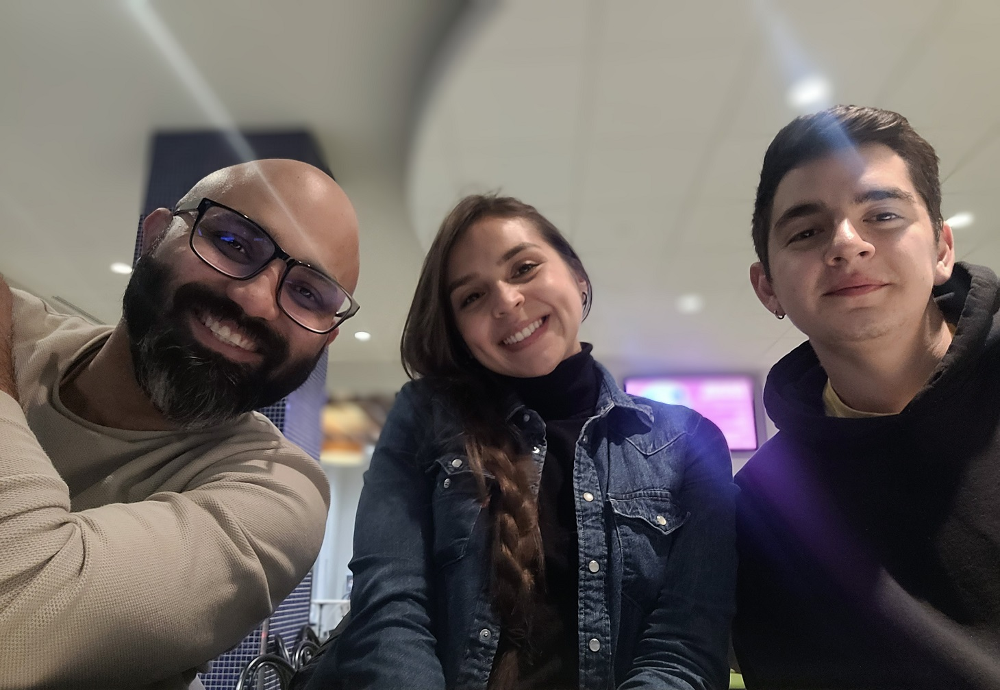

<!-- PROJECT LOGO -->
 

  

<h1 align="center">Welcome to the DiscordBot Repository</h1>

<h2 align="center">For TechWeek LaSalle College 2022.</h2>

Here we are going to explain in details how to run and incorporate this bot to your server in discord.

## About Us

We are students of LaSalle College who present an interesting topic for the student community. **Creating a Discord Bot from Scratch with Python.**

And in this repository you will find what is necessary for our Workshop.

But first let us introduce ourselves.

Emiliano Esquer: From Tijuana, Mexico. Graduated as an Industrial Engineer in Mexico and pursuing an AEC in Information Technology Programmer Analyst, currently in third semester.

Luis Davila: From Colombia, Graduated in System Engineering and Project Management and pursuing an AEC in Information Technology Programmer Analyst, currently in third semester.

Paola Gonzalez: Colombienne passionnée dans la recherche de nouvelles connaissances en lien avec l'informatique et à la technologie. Actuellement étudiante à temps plein en analyse de programmation ainsi qu’étudiante à temps partiel en commerce électronique.

If you want to know more about our Tech Week <a href="https://intlasalle.wixsite.com/tech-week">click here</a>

## Usage

This is a Docker image, which contains all the necessary Python development environment to be able to develop your Bot completely and without complications.

Go ahead use it as you like.
